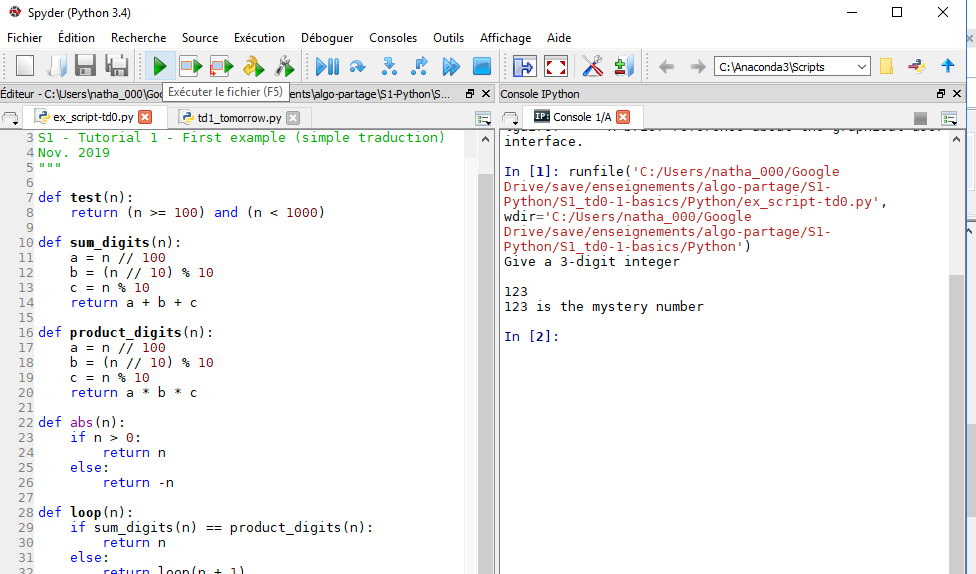

# Python installation - 2021-09

**Important: We only work with Python 3.x version (no 2.7 version)!**

If Python is not already installed on your computer, Spyder and/or Jupyter Notebook (= IPython Notebook) are recommended (no obligation). Below (see "Anaconda vs Miniconda" section) the instructions to install both via conda (tested on Ubuntu and Windows 10).

- **Jupyter Notebook** (= IPython Notebook on Windows) to work with notebooks!

    An example to see what notebooks look like: [in html](Boolean_vs_Bitwise.html) (to see the result) and [the source](Boolean_vs_Bitwise.ipynb) (to open with jupyter-notebook on Linux, or IPython-Notebook on Windows).

- With **Spyder** you have your editor and a console in the same environment. 

    Here is an example (object inspector and others tools have been closed):

    

### Anaconda vs Miniconda

You can either install Anaconda or miniconda. Have a look at the [conda user-guide](https://docs.conda.io/projects/conda/en/latest/user-guide/install/download.html#anaconda-or-miniconda) to choose!

## Install Anaconda (any OS)

If you have (a lot of) space to loose on your computer, just follow the instructions [here to install Anaconda](https://www.anaconda.com/download/)!

Spyder, IPython Notebook (= Jupyter) are installed (as well as many useless things).

## OR Install Miniconda, Spyder and Jupyter (recommended)

Miniconda will just add the conda package manager and Python.

- **Install miniconda**:

    Installation instructions (any OS) [can be found here](https://docs.conda.io/en/latest/miniconda.html) (choose "Python 3.x" version).

    Then to install "packages" first open a "console":
        
    - **Windows:** open Anaconda Prompt (should be in start menu > Anaconda).
        
    - **Linux:** open a terminal!

- **Install Spyder and or Jupyter Notebook:**

    From anaconda user-guide: [Spyder](https://anaconda.org/anaconda/Spyder) and [Jupyter](https://anaconda.org/anaconda/Jupyter), in your "console":

    ```bash
    conda install -c anaconda spyder
    conda install -c anaconda jupyter
    ```

## Install Pycharm (any OS)

Pycharm can also be used using [this link to install Pycharm](https://www.jetbrains.com/help/pycharm/installation-guide.html#standalone).
